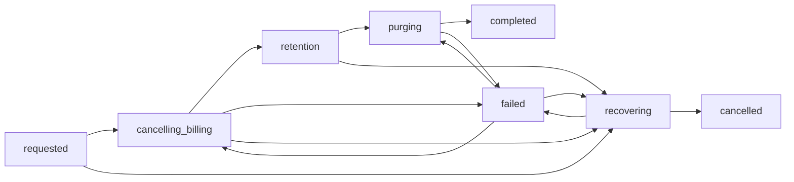

# Safe organisation deletion specification

This document specifies the implementation accepted by
[ADR 0002](./adr/0002-safe-organisation-deletion.md) for issue #77. It is an implementation plan,
not a claim about current behaviour. `DELETE /orgs/{org_id}` remains unregistered until the final
enablement step.

## 1. Safety properties

Every implementation PR must preserve these properties:

1. Organisation data is never purged while a linked subscription can still bill or resume, or its
   state is unknown.
2. Provider failure, worker failure, stale webhook delivery, and concurrency all fail closed with
   the organisation data retained.
3. The request is owner-only, explicitly confirmed, idempotent, and recoverable until purge starts.
4. Non-members cannot distinguish an existing organisation, an active deletion, and an unknown
   organisation.
5. The database records every lifecycle transition without storing ciphertext, raw Stripe
   responses, or secrets in the workflow record.
6. An organisation ID is never reused after a completed deletion.
7. Enabling the route is a separate final change after the tests, monitoring, and recovery runbook
   exist.

The server cannot recall data or keys already downloaded by a member. It also cannot identify every
existing share link because `share_links` currently records its creator but not the source
organisation. The confirmation screen and public documentation must state that these independent
copies are outside the deletion boundary. New share links should gain source attribution in
separate work so future organisation deletion can revoke attributable links.

## 2. User-visible contract

### Request deletion

```http
POST /orgs/{org_id}/deletion
Content-Type: application/json

{
  "confirm_org_id": "<the exact org_id>",
  "acknowledge_subscription_cancellation": true
}
```

The exact ID is used because the server stores the organisation name as ciphertext and cannot
validate a typed plaintext name. Both fields are required. A valid first request returns
`202 Accepted`; the same owner repeating it returns the same active operation and does not reset
`requested_at` or `purge_after`.

```json
{
  "state": "cancelling_billing",
  "requested_at": "2026-08-07T12:00:00Z",
  "recoverable_until": "2026-09-06T12:00:00Z",
  "managed_backup_expiry_by": "2026-10-06T12:00:00Z",
  "next_retry_at": null,
  "error": null
}
```

### Read status

```http
GET /orgs/{org_id}/deletion
```

Any current owner can read an active operation. After memberships are purged, only the requesting
owner can read the terminal operation for the audit-retention period. Other callers receive `404`.
The response exposes a sanitised error code such as `billing_unavailable`, `billing_unknown`, or
`purge_failed`; it never exposes provider identifiers or response bodies.

### Cancel deletion

```http
POST /orgs/{org_id}/deletion/cancel
```

Cancellation is allowed from `requested`, `cancelling_billing`, `retention`, or `failed`. It is
idempotent and returns `202 Accepted` while the operation moves through `recovering`. It returns
`409 Conflict` after `purging` begins because data removal may already be in progress. The recovery
worker performs a fresh billing lookup before restoring writes. The exhaustive provider mapping
restores Team for `active`, `trialing`, or `past_due`, and restores free for every other recognised
status or a missing subscription. A free restoration requires a new checkout to regain Team.

### Errors and ordinary organisation access

| Condition | Response |
|---|---|
| Unknown organisation or caller is not a member | `404 Not Found` |
| Caller is a member but not an owner | `403 Forbidden` |
| Confirmation is absent or does not match | `400 Bad Request` |
| Organisation is already deleted | `409 Conflict` for a new request; terminal status for its requester |
| Organisation write while deletion is active | `409 Conflict` with `organisation deletion is in progress` |
| Billing is linked but the provider is not configured | Accepted, then `failed` with `billing_unavailable`; no purge |

Reads and export remain available to existing members during the recovery window. All mutating
organisation paths must be blocked, including checkout and portal creation, member and grant
changes, project and environment creation, secret writes, rotation, and machine-token changes.
After purge, ordinary organisation and resource routes return `404`.

## 3. Lifecycle



| State | Meaning | Permitted next states |
|---|---|---|
| `requested` | The database accepted the confirmed request and froze writes. | `cancelling_billing`, `recovering` |
| `cancelling_billing` | Cancellation or authoritative reconciliation is due. | `retention`, `failed`, `recovering` |
| `retention` | The billing gate is confirmed `Terminal` or `Missing` and the recovery deadline has not passed. | `purging`, `recovering` |
| `purging` | A worker owns the final database purge. Recovery is no longer possible. | `completed`, `failed` |
| `recovering` | An owner cancelled deletion; billing is being reconciled before writes return. | `cancelled`, `failed` |
| `failed` | Automatic attempts stopped after a sanitised, recorded failure. Data remains intact and write-frozen. | The recorded resume state, or `recovering` |
| `cancelled` | Billing was reconciled and the organisation was recovered. | Terminal for this attempt. A later request creates a new attempt. |
| `completed` | Primary organisation data was purged and only the tombstone, deletion record, and retained audit metadata remain. | Terminal |

`purge_after` is fixed at `requested_at + 30 days` by default. The hosted value may be changed only
through a documented configuration value and must never be shortened for an operation already in
progress. Billing confirmation can delay purge beyond that date but can never bring it forward.

Automatic provider retries use bounded exponential backoff with jitter: one minute, five minutes,
30 minutes, two hours, six hours, and 24 hours. Exhaustion moves the operation to `failed` and
alerts an operator. An owner repeating the confirmed request or an operator running the documented
retry command safely schedules the recorded resume state without creating a second operation.

## 4. Module boundaries

`org_deletion` owns the lifecycle and exposes a small interface to HTTP handlers and the worker:

```text
request(org_id, actor, confirmation) -> DeletionView
status(org_id, actor) -> DeletionView
cancel(org_id, actor) -> DeletionView
claim_due(worker_id, now) -> Option<DeletionLease>
advance(lease, subscription_provider, clock) -> DeletionView
```

Handlers translate HTTP inputs and errors only. They must not issue provider calls or delete child
rows. The worker calls `advance` and has no independent transition logic.

Provider-specific cancellation sits behind this port:

```text
SubscriptionProvider.cancel(subscription_id, operation_key) -> CancellationResult
SubscriptionProvider.status(subscription_id) -> SubscriptionObservation

SubscriptionObservation {
    purge_gate: Blocking | Terminal | Missing,
    entitlement: Team | Free,
}
```

Purge safety and Sotto entitlement are separate decisions. For example, an unpaid Stripe
subscription blocks purge because it can still create invoices, but maps to Sotto's free tier.
Transport, authentication, timeout, and unknown-status errors are errors, not `Terminal` or
`Missing`. Stripe is the production adapter. A deterministic in-memory adapter controls successes,
failures, and out-of-order observations in tests. The existing checkout and portal behaviour may
continue behind its current interface; deletion must not reach into Stripe HTTP helpers directly.

The data purger is an internal adapter. Its only public operation accepts a leased deletion attempt
whose billing precondition has already been checked. It rechecks that precondition in the database
transaction before deleting anything.

## 5. Data model

A forward-only migration adds:

```sql
ALTER TABLE organizations
    ADD COLUMN lifecycle_state TEXT NOT NULL DEFAULT 'active'
        CHECK (lifecycle_state IN ('active', 'deleting', 'deleted')),
    ADD COLUMN deleted_at TIMESTAMPTZ,
    ALTER COLUMN enc_name DROP NOT NULL;

CREATE TABLE organization_deletions (
    id UUID PRIMARY KEY,
    org_id TEXT NOT NULL REFERENCES organizations (id) ON DELETE RESTRICT,
    state TEXT NOT NULL,
    resume_state TEXT,
    requested_by TEXT NOT NULL,
    requested_at TIMESTAMPTZ NOT NULL,
    purge_after TIMESTAMPTZ NOT NULL,
    subscription_id TEXT,
    last_billing_state TEXT,
    billing_checked_at TIMESTAMPTZ,
    billing_observation_source TEXT,
    billing_observed_by TEXT,
    billing_observation_reason TEXT,
    billing_observation_evidence TEXT,
    attempt_count INTEGER NOT NULL DEFAULT 0,
    next_attempt_at TIMESTAMPTZ,
    last_error_code TEXT,
    state_version BIGINT NOT NULL DEFAULT 0,
    lease_owner TEXT,
    lease_expires_at TIMESTAMPTZ,
    cancelled_at TIMESTAMPTZ,
    completed_at TIMESTAMPTZ,
    managed_backup_expiry_by TIMESTAMPTZ
);
```

The migration must add check constraints for timestamps and legal state fields, an index for due
work and expired leases, and a partial unique index allowing only one non-terminal deletion per
`org_id`. Operator billing observations must include an evidence reference. Exact SQL is left to the
data PR so its constraints can be tested directly.

`organizations.lifecycle_state` is the hot access-control flag; `organization_deletions.state` is
the workflow phase. They change together in one database transaction. A cancelled attempt restores
`active`; final purge sets `deleted`. This is intentional separation, not duplicated workflow
state.

The retained `organizations` row is the permanent tombstone. Database constraints enforce that at
completion it contains only:

- `id`, `created_at`, `lifecycle_state = 'deleted'`, and `deleted_at`;
- no encrypted name or creator;
- `tier = 'free'`, no trial, and no Stripe customer or subscription ID.

Keeping the row means `audit_events.org_id` can retain its foreign key and history, `POST /orgs`
cannot reuse the identifier, and a stale webhook can be ignored rather than targeting a future
organisation. Applied migration files are not edited; new migrations supersede their historical
comments where necessary.

## 6. Billing rules

The deletion request snapshots the linked subscription ID while holding the organisation row lock.
If there is no subscription ID, the worker can enter `retention` without Stripe. A Team tier without
a subscription ID is treated as manually managed entitlement and also has no external subscription
to cancel.

For a linked subscription:

1. The worker asks the provider for current status.
2. `Terminal` or `Missing` satisfies the billing gate.
3. `Blocking` causes an immediate cancellation request, followed by another status lookup.
4. A timeout, unexpected response, or unrecognised status is unknown and schedules a retry without
   changing organisation data. An authentication or permission error fails immediately as
   `billing_unavailable` and alerts an operator.
5. A fresh status lookup is repeated immediately before the transition to `purging`.

The Stripe adapter maps statuses exhaustively, without a wildcard arm:

| Stripe result | Purge gate | Sotto entitlement |
|---|---|---|
| `active`, `trialing`, `past_due` | `Blocking` | Team |
| `incomplete`, `paused`, `unpaid` | `Blocking` | Free |
| `canceled`, `incomplete_expired` | `Terminal` | Free |
| `resource_missing` from lookup of the exact subscription ID | `Missing` | Free |

Any new or unrecognised Stripe status is unknown and blocks purge until the adapter is deliberately
updated. `pause_collection` does not need a separate rule: Stripe leaves the subscription status
unchanged when collection is paused, so the exhaustive status mapping still gives the right gate.
This mapping must not reuse the entitlement-only `ACTIVE_STATUSES` constant.

The Stripe HTTP helper must preserve the response status and `error.code` instead of collapsing all
non-success responses into an opaque upstream error. The adapter classifies lookup results as
follows:

| Stripe result | Deletion outcome |
|---|---|
| `resource_missing` for the exact subscription lookup | `Missing`; satisfies the gate |
| HTTP `401` or `403`, including an expired, invalid, or under-permissioned key | `failed` immediately with `billing_unavailable`; alert an operator |
| `rate_limit_error`, `api_error`, HTTP `429` or `5xx`, transport failure, or timeout | Unknown; use the retry ladder |
| Anything unrecognised | Unknown; use the retry ladder |

An operator may record an authoritative manual billing observation when the configured provider is
unavailable, so a self-hoster is not permanently blocked by a historical subscription ID. This is
an operator-only command, not a public endpoint or bypass flag. It requires the exact organisation
and subscription IDs, the observed Stripe status, observation time, actor, reason, and an evidence
reference such as a Stripe Dashboard request or subscription URL. It writes the same billing-result
fields used by the provider adapter plus an audit event with `source = 'operator'`.

A manual observation follows the same exhaustive status mapping and must be no more than 15 minutes
old when purge begins. A stale, mismatched, non-terminal, or unaudited observation does not satisfy
the gate. The operator must therefore recheck Stripe immediately before an overdue purge, just as
the automated path performs a fresh lookup.

Stripe cancellation is immediate rather than `cancel_at_period_end`. The adapter first looks up the
subscription and only sends `DELETE` for a `Blocking` observation. It passes the deletion operation
ID as a stable provider idempotency key where supported. If cancellation fails or times out, the
adapter looks up the subscription again; only the fresh observation can satisfy the gate. This
makes an already cancelled subscription harmless without assuming what a second Stripe `DELETE`
returns.

Cancellation explicitly sends `invoice_now=false` and `prorate=false`, even though those are the
current Stripe defaults. It creates no final invoice or automatic credit or refund for unused time,
and Stripe stops automatic collection of the customer's already-finalised invoices. The owner
confirmation must state these consequences in those terms. Neither the application nor the runbook
may resume automatic collection after the organisation has been purged.

Cancellation of the deletion changes `state_version` and enters `recovering`. This invalidates an
in-flight worker result, but the provider call may already have happened, so recovery never guesses
from local state. It queries the snapshotted subscription and applies the observation's entitlement:
Team restores Team, while Free or `Missing` restores free. A provider error leaves the organisation
write-frozen and retries recovery.

The first implementation cancels the linked subscription but does not delete the Stripe customer.
The cancellation request writes the deleted organisation ID to the subscription's
`cancellation_details.comment`, giving support a durable path from the retained customer and
subscription to Sotto's tombstone. It does not update customer metadata because that would require
Customers write and weaken the restricted key boundary.

If the lookup returns `resource_missing`, there is no subscription on which to write that comment.
Support must instead use the deletion audit event and provider request logs to trace the retained
customer. This is the accepted traceability limit while the restricted key excludes Customers write.

Stripe retains the customer, invoices, and other billing records under its own retention
obligations. The final purge clears Sotto's customer ID, so a later, unrelated organisation creates
a new Stripe customer rather than reusing the orphaned one. This deliberate trade-off can accumulate
orphaned customers in Stripe; support uses the cancellation comment and subscription relationship
to trace them.

Organisation deletion is not personal data erasure. A retained Stripe customer can still hold an
email address, name, postal address, and payment-method metadata. A data-subject erasure request is
a separate operational and provider process. The owner confirmation and privacy documentation must
distinguish Sotto's local purge, Stripe's retained billing records, and that separate erasure path.

Relevant webhook event IDs and their Stripe `created` timestamps are persisted. Event ID uniqueness
rejects redelivery; it does not establish order. A per-subscription watermark rejects an event older
than the last applied event. Two distinct events with the same timestamp trigger a fresh provider
lookup rather than using arrival order. This ordering guard also applies to the ordinary entitlement
path, so an old `customer.subscription.updated` event cannot overwrite a newer tier decision.

During an active deletion, webhook payloads may update the observed billing state and wake the
worker, but they do not advance the workflow by themselves. The worker performs a fresh provider
lookup, so event order is immaterial to purge. The three existing webhook updates in
`checkout_completed`, `subscription_updated`, and `subscription_deleted` must each include
`AND lifecycle_state = 'active'` in the `UPDATE organizations` predicate. Webhooks have no user
actor, so this database predicate is separate from the actor-scoped access lookup. A late checkout
or subscription event can therefore neither restore Team while an organisation is deleting nor
repopulate a deleted tombstone's billing identifiers.

## 7. Purge and retention boundary

The purge transaction checks all of the following while holding locks on the organisation and
deletion rows:

- the operation is still `purging` and the lease and `state_version` match;
- `purge_after` has passed;
- the organisation is still `deleting`;
- the current subscription ID is either the snapshot ID or `NULL` after its confirmed cancellation;
  any different non-null ID blocks purge;
- the most recent authoritative billing result is `Terminal` or `Missing` and is newer than the final
  reconciliation request. It may come from the provider adapter or a fresh, audited operator
  observation through the same stored mechanism.

It then deletes organisation-owned primary data in this order:

1. organisation projects, relying on existing child cascades for environments, secrets, secret
   versions, environment grants, and machine tokens;
2. organisation memberships, removing every wrapped organisation key;
3. any future share links with explicit source-organisation attribution;
4. billing identifiers, encrypted organisation name, creator, and trial metadata, using one
   `UPDATE organizations` that also sets `lifecycle_state = 'deleted'` and `deleted_at`. The
   tombstone checks are immediate, so clearing those fields and changing the lifecycle state must
   be atomic.

The transaction sets the retained organisation row to `deleted`, records `org.deletion.completed`,
and marks the deletion attempt `completed`. It does not delete `audit_events` or the deletion record.
Audit entries remain subject to the product's audit-retention policy; lifecycle and tombstone
metadata remain for as long as identifier reuse must be prevented.

The existing deployment recommends backups that expire after approximately 30 days. A purge removes
primary data after the recovery window, but a backup taken just before purge can retain ciphertext
for up to that additional backup lifecycle. Status and documentation must report both the recovery
deadline and the latest managed-backup expiry. Self-hosted operators are responsible for matching
their configured value to their real storage lifecycle and for deleting unmanaged exports.

The restore runbook must require an isolated restore, reconciliation of deletion attempts and
tombstones from the newest retained operational record, completion of any overdue purge, and only
then reopening traffic. The endpoint must not be enabled on the hosted service until this procedure
has been rehearsed. This design does not call backup retention crypto-shredding: clients can retain
keys and copies, and current organisation deletion does not destroy an independent root key.

## 8. Authorisation and access guards

The request transaction locks the organisation and its owner memberships before checking the
caller's role. Any owner may request deletion; all owners can see and cancel it during retention.
The action and actor are written to the audit log in the same transaction as the state change.

The current `org::role_of` lookup is not a sufficient lifecycle guard because callers need
different read and write behaviour. Introduce one shared organisation access lookup that returns
the role and lifecycle state. All org-scoped modules, including sync access, entitlements, audit,
billing, memberships, grants, and project creation, must use it. Tests must enumerate every
mutating route so adding a new route without the guard is visible in review.

Provider webhooks are the deliberate exception to this actor-scoped lookup. They enforce lifecycle
inside every guarded SQL update as described in section 6, because no user role exists on that path.

Machine tokens inherit the lifecycle check through environment access. Reads continue in
`deleting`; writes return the same conflict as session-authenticated writes. In `deleted`, all
ordinary access resolves as not found.

## 9. Concurrency and idempotency

- The partial unique index and locked organisation row make simultaneous initial requests converge
  on one active operation.
- Workers claim due rows with `FOR UPDATE SKIP LOCKED`, a bounded lease, and a unique worker ID.
- Deletion workers do not hold a database lock during a Stripe network call. They record the
  expected `state_version`, call the provider, then apply a compare-and-set transition. The
  user-facing checkout and portal session calls are deliberate bounded exceptions: they keep the
  organisation row lock while Stripe responds so a deletion transition cannot race the billing
  side effect. Equal-timestamp webhook reconciliation is another exception; it keeps a per-
  subscription advisory lock while fetching Stripe so concurrent snapshots cannot overwrite one
  another. These calls briefly pin a pool connection and serialise the affected writes.
- A lost worker can be replaced after its lease expires. A late worker result with an old version
  is discarded.
- Provider cancellation is invoked idempotently and status is reconciled afterwards.
- Cancellation races by changing `state_version`; an in-flight worker cannot purge after an owner
  has requested recovery, and recovery reconciles any provider call that was already in flight.
- Webhook redelivery is deduplicated by provider event ID. Webhook order cannot bypass a provider
  lookup or the final database preconditions.

## 10. Operations, credentials, and monitoring

### Stripe API version and credentials

All Stripe requests must send `Stripe-Version: 2026-07-29.dahlia`. The version is a source constant,
not the Stripe account default, because a Dashboard change must not alter payloads that gate data
destruction. The Stripe webhook endpoint must be configured to emit the same version. The generic
webhook parser records and acknowledges a mismatched or absent `api_version` without reading or
applying its object, then logs an operator warning. This fails closed for billing and deletion state
without causing Stripe to retry the same incompatible event forever.

An API-version upgrade changes the request constant, webhook endpoint, response parser, fixtures,
and credentialed smoke test together in one reviewed change. Stripe Workbench, the Dashboard's
request-log and API-version view, must show the pinned version for both application requests and
webhook deliveries before that change is enabled. Rollout pins the endpoint first, deploys the
matching parser, verifies delivered events, and only then enables deletion. After enablement, a
version mismatch is an operator incident and remains fail closed rather than becoming a retry.
Processed webhook receipts are retained for 30 days; request-time pruning deletes up to 500 older
processed rows unless an ordering watermark still references them. Failed reconciliation receipts
remain eligible after a one-day retry grace period. The processed and pending indexes keep this
bounded cleanup from scanning unrelated rows.

Hosted and production deployments use a restricted Stripe API key (`rk_`), supplied as
`STRIPE_API_KEY`, instead of an unrestricted `STRIPE_SECRET_KEY`. The intended permissions are
Checkout Sessions write, Billing Portal write, Subscriptions write, and Customers read, with every
other resource set to none. Subscriptions write is required for cancellation; Customers write is
deliberately excluded because this workflow retains the customer. Workbench request logs are the
final authority for the exact permission names and any implicit dependency.

Each environment has its own key and webhook secret. Both live in the hosting platform's secrets
vault, never a committed environment file. Migration starts with cataloguing existing calls in
Workbench, creates a test-mode restricted key with the intended permissions, runs the complete
billing and deletion suites while watching `stripe logs tail` for `403` responses, then swaps the
production secret and rotates the old unrestricted key. Permissions are widened only for a
reviewed, observed call. The checkout and portal implementation uses `STRIPE_API_KEY`, and the
deployment examples pass that restricted key before billing is enabled.

Record user-visible audit events for request, recovery, billing cancellation confirmation,
terminal failure, purge start, and completion. Retry noise belongs in structured operational logs
and metrics, not the organisation audit stream. Store sanitised error codes in PostgreSQL; keep raw
provider errors out of responses and persistent metadata.

Required metrics:

- deletion attempts by state;
- age of the oldest operation in each non-terminal state;
- provider cancellation and reconciliation attempts by outcome;
- lease expiry and stale compare-and-set counts;
- purge duration and failures.

Alert when an operation reaches `failed`, remains in `cancelling_billing` beyond 24 hours, is due for
purge but has not advanced, or loses repeated worker leases.

The runbook must cover inspecting a sanitised operation, retrying its recorded resume state,
recording a fresh operator billing observation when provider credentials are unavailable,
cancelling before purge, handling a failed purge, and the isolated restore procedure. No runbook
command may skip the billing observation mechanism or directly delete an `organizations` row.

## 11. Verification

### State-machine tests

- Free organisation reaches retention without calling the provider.
- A blocking paid subscription is cancelled and then confirmed terminal.
- A missing subscription satisfies the gate; an unknown status does not.
- Each retryable provider failure schedules the documented retry; authentication and permission
  failures enter `failed` immediately.
- Repeating a request or retry does not create a second active operation or extend retention.
- Cancellation from every allowed state reconciles billing before restoring access; cancellation
  after purge starts fails.
- Recovery racing an in-flight provider cancellation settles to the provider's final tier.
- Recovery after provider cancellation restores the free tier.
- A fresh, audited operator observation can satisfy the same terminal-state gate; stale,
  mismatched, non-terminal, and unaudited observations cannot.

### Database and API tests

- Owner, non-owner member, non-member, malformed confirmation, and missing organisation responses.
- Two concurrent requests and two workers converge without duplicate cancellation or purge.
- Every org-scoped write is rejected while deleting; reads and export still work.
- Final purge removes the full project tree, grants, memberships, machine tokens, encrypted name,
  and billing linkage while retaining the organisation tombstone and audit history.
- A completed ID cannot be recreated.
- Repeating status, cancellation, worker, webhook, and purge calls is harmless.

### Billing race tests

- The Stripe adapter table-tests all eight documented subscription statuses and an unknown future
  status. Only `canceled`, `incomplete_expired`, and exact-resource `resource_missing` satisfy the
  purge gate.
- Provider tests distinguish `resource_missing`, HTTP `401/403`, HTTP `429/5xx`, transport timeout,
  `api_error`, and an unrecognised error without parsing human-readable messages.
- Every Stripe request carries `Stripe-Version: 2026-07-29.dahlia`; a webhook with a different or
  absent `api_version` changes no state.
- Cancellation looks up first, sends explicit `invoice_now=false` and `prorate=false`, and looks up
  again after success, timeout, and provider error. A terminal or missing subscription never needs
  a second destructive call.
- Duplicate and out-of-order updated/deleted webhooks cannot move the lifecycle forwards alone.
- An older subscription event cannot overwrite a newer ordinary entitlement decision; equal-time
  events reconcile against current provider state.
- An active webhook after cancellation causes reconciliation and blocks purge.
- A stale checkout webhook cannot reactivate a deleting or deleted organisation.
- Provider failure between cancellation and confirmation retains all organisation data.
- Every billing webhook handler is exercised against `active`, `deleting`, and `deleted` rows so a
  missing lifecycle predicate fails a test.

### Client and operational tests

- The web flow requires the exact ID and acknowledgement, shows both retention deadlines, and can
  recover before purge.
- The CLI reports the write conflict clearly and continues to support read/export during retention.
- A deterministic end-to-end test covers free deletion and recovery.
- A Stripe Test Clock advances a subscription through a renewal during the recovery window while
  the injected Sotto clock independently advances retention. The renewal must block purge until the
  adapter cancels and refetches the subscription.
- The external smoke test provisions an isolated anonymous sandbox with
  `stripe sandbox create --non-interactive`, captures and masks its temporary key before use, and
  does not depend on a shared long-lived test key. If anonymous sandbox automation proves
  unreliable, the fallback is a dedicated environment-specific sandbox with a restricted key,
  never a shared unrestricted account key.
- `stripe listen` forwards to the real local webhook path and supplies its temporary signing
  secret; `stripe trigger customer.subscription.deleted` uses the pinned API version and fixture
  overrides needed to name the test organisation. This exercises signature verification rather
  than posting a hand-signed fixture directly.
- The credentialed adapter smoke cancels a real sandbox subscription, runs the adapter again, and
  asserts one effective cancellation, terminal reconciliation, cancellation context, and no final
  invoice or automatic proration credit. It never runs on forks.
- A backup restore drill proves tombstones are reconciled before traffic and that an overdue purge
  resumes safely.

## 12. Delivery plan

Each item is an independently reviewable PR. The route remains absent through items 1 to 8.

1. **Data:** add lifecycle columns, deletion operations, constraints, indexes, and migration tests.
2. **Access:** add the shared lifecycle-aware access lookup and freeze every org-scoped write, with
   route-inventory tests.
3. **Billing:** add `SubscriptionProvider`, pin `Stripe-Version`, preserve structured provider
   errors, use the restricted `STRIPE_API_KEY`, and add the Stripe cancellation and status adapter,
   webhook deduplication, and race tests. Do not expose an endpoint.
4. **Lifecycle:** add request, cancel, leasing, retries, reconciliation, and purge behind internal
   functions with deterministic state-machine and database tests.
5. **API:** add handlers and response types without registering their routes in the production
   router. Test them through a test-only router.
6. **Client:** add confirmation, read-only state, status, recovery, and honest limits. Keep the
   control unavailable against production until enablement.
7. **Tests:** add the cross-module concurrency, billing-race, complete-purge, recovery, and
   end-to-end suites after the underlying seams exist.
8. **Operations:** add metrics, alerts, retention configuration, the backup/restore runbook, and a
   rehearsed recovery record.
9. **Enablement:** register the routes, enable the client control, run the complete database,
   Playwright, and credentialed Stripe suites, then update public documentation.

The enablement PR must include a checklist linking the evidence for every safety property in
section 1. A destructive cascade or a synchronous `DELETE /orgs/{org_id}` is not an acceptable
shortcut in any intermediate change.
